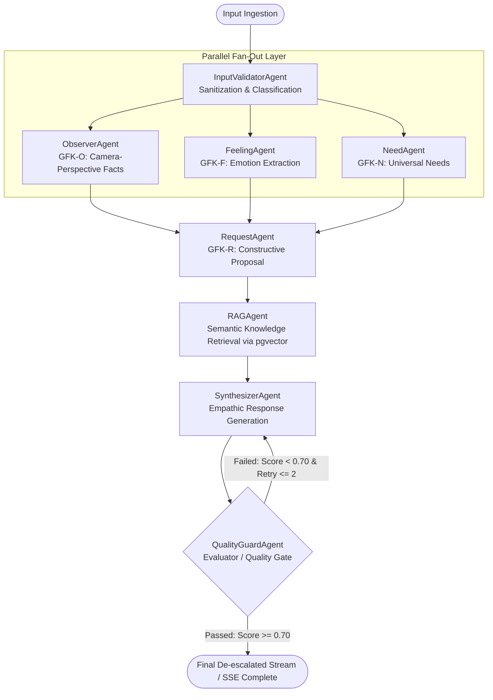

<div align="center">

# 🕊️ landmans Core — NVC De-escalation Engine
### Enterprise-Grade Stateful Multi-Agent System for Conflict Transformation

[](https://python.org)
[](https://fastapi.tiangolo.com/)
[](https://langchain-ai.github.io/langgraph/)
[](https://docs.pydantic.dev/)
[](https://github.com/pgvector/pgvector)
[](https://react.dev/)
[](https://tailwindcss.com/)

<p align="center">
  <a href="#-executive-summary">Executive Summary</a> •
  <a href="#-system-architecture--agent-topology">System Architecture</a> •
  <a href="#-architectural-highlights--engineering-decisions">Engineering Highlights</a> •
  <a href="#-the-4-pillar-nvc-cognitive-engine">NVC Cognitive Engine</a> •
  <a href="#-enterprise-tech-stack">Tech Stack</a> •
  <a href="#-quickstart--local-installation">Quickstart</a>
</p>

</div>

---

## 📌 Executive Summary

Modern customer operations, team communication channels, and enterprise help desks frequently suffer from high-friction, emotionally escalated interactions. Standard off-the-shelf LLMs routinely fail in de-escalation scenarios: they output superficial platitudes, hallucinate factual timelines, or propose misaligned compromises.

**landmans Core — NVC De-escalation Engine** is a deterministic, stateful multi-agent system based on **Marshall B. Rosenberg's Nonviolent Communication (NVC / GFK)** framework. Rather than relying on a monolithic prompt, it operationalizes human conflict resolution into an **8-node Directed Cyclic Graph (DCG)** orchestrated with **LangGraph**. 

The system decomposes hostile inputs into objective facts, emotional baselines, and unmet core needs, retrieves grounded domain communication patterns via **pgvector RAG**, and synthesizes an empathetic response through an autonomous **Critique-and-Refine (Reflection) Loop**.

---

## 🏛️ System Architecture & Agent Topology

The core engine utilizes an asynchronous, non-blocking actor pipeline governed by a strongly typed **Pydantic v2 State Monad (`GFKState`)**. To minimize operational latency, the analytical phase executes via a **Parallel Fan-Out / Fan-In pattern** prior to contextual retrieval and final synthesis.

### LangGraph Topology & Cyclic Quality Gate




---

## 🔬 Architectural Highlights & Engineering Decisions

### 1. Stateful Multi-Agent Execution via Pydantic v2 State Monad
Unlike simplistic agent chains relying on untyped Python dictionaries (`TypedDict`), the state schema (`GFKState`) is enforced at every node boundary using **Pydantic v2**. This guarantees:
* **Strict Runtime Type Safety:** Immediate validation of inter-agent payloads and zero schema drift across graph transitions.
* **Granular Telemetry:** In-memory profiling recording microsecond-level latency breakdown (`processing_time_ms`) across every agent execution.

### 2. Guardrailed Anti-Hallucination Extraction (Camera Metaphor)
The `ObserverAgent` enforces strict zero-hallucination guardrails. When processing generalizations such as *"You always ignore my requests"*, generic LLMs frequently fabricate timeline metrics (e.g., *"You ignored me 3 times this week"*). 
* **The Solution:** The agent executes under a mathematical **Camera-Perspective Constraint**: it extracts exclusively sensory-verifiable data, discarding assumptions, ungrounded numbers, and bracketed placeholder tokens (`[...]`).

### 3. Cyclic Self-Correction & Bounded Reflection Loop
The engine implements an active **Evaluator-Optimizer pattern**:
* Generated responses pass through the `QualityAgent`, which scores GFK compliance, tone de-escalation, and completeness on a scale of `0.0 – 1.0` (Threshold: `0.70`).
* If a draft fails, structured critique (`issues`, `feedback`) is appended to the graph state. The graph triggers a conditional edge back into `SynthesizerAgent` for zero-shot iterative correction.
* **Circuit Breaker:** Hard-capped at `retry_count = 2` to eliminate non-terminating loops and manage token consumption deterministically.

### 4. Resilient Vector Retrieval with Zero-Downtime Fallback
The `RAGAgent` queries an enterprise knowledge base of conflict resolution strategies:
* **Primary Target:** `pgvector` hosted on PostgreSQL / Oracle Cloud Infrastructure.
* **Degraded-Mode Fallback:** If the external database connection drops, `VectorStore` automatically degrades gracefully to an in-memory cosine-similarity matrix. Retrieval remains functional without crashing the inference pipeline.
* **Token Cost Optimization:** The retrieval query is dynamically constructed from extracted feelings and needs, executing pure similarity searches without costly intermediate LLM re-ranking queries.

### 5. Provider-Agnostic Hybrid LLM Factory
Equipped with an abstracted factory pattern (`LLMFactory`), decoupling application code from underlying providers:
* **Local / Air-Gapped / Privacy Mode:** `Ollama` running quantized models (`qwen2.5-coder`).
* **High-Throughput Production:** `OpenAI` (`gpt-4o-mini` / `gpt-4o`).
* Switchable on the fly via `.env` configuration without altering orchestration logic.

---

## 🧠 The 4-Pillar NVC Cognitive Engine

| Component | Class | Operational Role | Cognitive Output |
| :--- | :--- | :--- | :--- |
| **Observation (O)** | `ObserverAgent` | Filters subjective accusations into verifiable camera-recorded facts. | `"Statement received expressing perception that tasks were left uncompleted."` |
| **Feeling (F)** | `FeelingAgent` | Isolates raw human emotion while pruning pseudo-feelings (interpretations). | `["overwhelmed", "frustrated", "anxious"]` |
| **Need (N)** | `NeedAgent` | Maps emotional distress to universal, non-negotiable human needs. | `["Clarity", "Reliability", "Autonomy"]` |
| **Request (R)** | `RequestAgent` | Synthesizes O-F-N into a positive, actionable, and collaborative invitation. | `"Would you be open to a 10-minute sync at 2 PM to align priorities?"` |

---

## 🛠️ Enterprise Tech Stack

| Layer | Technology | Specifications & Role |
| :--- | :--- | :--- |
| **Agent Orchestration** | **LangGraph** `>=0.2.0` | Stateful cyclical multi-agent graph with Fan-Out / Fan-In patterns |
| **Cognitive Framework** | **LangChain** `>=0.3.0` | Node abstraction, prompt template management & output parser contracts |
| **LLM Inference** | **OpenAI API & Ollama** | Hybrid architecture: Local `qwen2.5-coder` / Cloud `gpt-4o-mini` |
| **Vector Engine & RAG** | **pgvector / PostgreSQL** | High-dimensional semantic search; zero-overhead cosine similarity |
| **Embeddings** | **Sentence-Transformers** | Local `mpnet-base-v2` (multilingual) & OpenAI `text-embedding-3-small` |
| **Backend & Ingestion** | **FastAPI** `>=0.111.0` | Async event-loop runtime with native Server-Sent Events (SSE) support |
| **Schema Validation** | **Pydantic v2** `>=2.7.0` | High-throughput data contracts, runtime validation & serialization |
| **Observability & Logs**| **Structlog** | Distributed JSON tracing and inter-agent telemetry profiling |
| **Frontend Runtime** | **React 19, TypeScript** | Modern reactive UI, real-time node state visualizer |
| **Build & Styling** | **Vite & Tailwind CSS v3.4** | Ultra-low footprint dashboard, custom Glassmorphism components |
| **Testing & CI** | **pytest, pytest-asyncio** | Async unit testing, deterministic mock graphs, coverage reports |

---

## 📂 Repository Topology

```text
landmans-core-nvc/
├── agents/                       # Specialized LangGraph Worker Nodes
│   ├── base_agent.py             # Abstract base agent with telemetry & LLM bindings
│   ├── input_validator.py        # Input sanitization, length guardrails & intent tagging
│   ├── observer_agent.py         # Zero-hallucination factual observation extraction (O)
│   ├── feeling_agent.py          # Emotion classifier pruning pseudo-feelings (F)
│   ├── need_agent.py             # Human value & universal unmet need mapping (N)
│   ├── request_agent.py          # Constructive behavioral invitation synthesizer (R)
│   ├── rag_agent.py              # Zero-overhead vector search agent
│   ├── synthesizer_agent.py      # Final empathetic response compiler (streaming enabled)
│   └── quality_guard.py          # Multi-metric evaluator & cyclic feedback controller
│
├── api/                          # Asynchronous Transport & Gateway Layer
│   ├── router.py                 # Core de-escalation REST & SSE endpoints
│   ├── auth_routes.py            # Authentication, JWT & DSGVO/GDPR access controls
│   ├── schemas.py                # Pydantic Request & Response DTOs
│   └── middleware.py             # Security headers, CORS & structured audit logging
│
├── config/                       # Configuration Management
│   └── settings.py               # Central environment configuration (Pydantic Settings)
│
├── core/                         # Orchestration & State Runtime
│   ├── state.py                  # Pydantic v2 GFKState definition & QualityReport schema
│   ├── graph.py                  # LangGraph StateGraph builder, node edges & conditional routing
│   └── llm_factory.py            # Dynamic hybrid LLM factory (Ollama ↔ OpenAI switch)
│
├── rag/                          # Information Retrieval Subsystem
│   ├── embedder.py               # Unified lazy-loading embedding interface
│   ├── vector_store.py           # pgvector connector with automated in-memory degradation
│   └── retriever.py              # Semantic text-chunking pipeline & knowledge loader
│
├── data/knowledge_base/          # Verified domain documents (.txt, .md) on conflict resolution
├── src/                          # React 19 Client Dashboard
│   ├── components/               # Real-time state trackers, copy widgets, stream viewports
│   └── main.tsx                  # Client entry point
│
├── tests/                        # Automated Test Harness
│   ├── test_state.py             # State validation & schema immutability tests
│   ├── test_agents.py            # Individual node extraction unit tests
│   ├── test_graph.py             # Multi-agent conditional routing & loop limit tests
│   └── test_api.py               # FastAPI integration & SSE response tests
│
├── main.py                       # Application Entry Point (Uvicorn ASGI runner)
├── requirements.txt              # Locked Python dependencies
└── package.json                  # Frontend dependencies & build scripts
```

---

## ⚡ Quickstart & Local Installation

### Prerequisites
* **Python 3.11+**
* **Node.js 18+** & npm
* OpenAI API Key (or a running local **Ollama** instance)
* *(Optional)* Docker & Docker Compose for containerized PostgreSQL/pgvector

### 1. Clone & Set Up Backend

```bash
# Clone repository
git clone https://github.com/your-username/landmans-core-nvc.git
cd landmans-core-nvc

# Initialize and activate Python virtual environment
python -m venv venv
source venv/bin/activate  # On Windows: venv\Scripts\activate

# Install locked dependencies
pip install -r requirements.txt

# Configure environment variables
cp .env.example .env
# Open .env and add your OPENAI_API_KEY (or set LLM_PROVIDER=ollama)

# Start FastAPI ASGI server
python main.py
```
> The API Gateway and Swagger docs are now operational at `http://localhost:8000/docs`.

### 2. Set Up Frontend Dashboard

```bash
# In a new terminal window:
npm install

# Launch Vite development server
npm run dev
```
> Access the glassmorphic analytics dashboard at `http://localhost:5173`.

---

## 📡 API Specification & Streaming Protocol

### `POST /api/v1/deescalate/stream`
Triggers the multi-agent graph and opens a persistent **Server-Sent Events (SSE)** connection. Emits node lifecycle transitions, live synthesized tokens, and the final structured analytical payload.

#### Request Payload
```json
{
  "raw_input": "You completely ruined the deployment timeline and nobody cares!",
  "language": "en",
  "llm_provider": "openai"
}
```

#### Server-Sent Event (SSE) Stream
```text
event: agent_start
data: {"agent": "InputValidatorAgent", "status": "active"}

event: agent_start
data: {"agent": "ObserverAgent", "status": "parallel_eval"}

event: agent_start
data: {"agent": "FeelingAgent", "status": "parallel_eval"}

event: agent_start
data: {"agent": "NeedAgent", "status": "parallel_eval"}

event: token
data: {"token": "I"}

event: token
data: {"token": " understand"}

event: token
data: {"token": " how"}

event: complete
data: {
  "observation": "Statement indicates that the deployment did not adhere to the scheduled schedule.",
  "feelings": ["stressed", "disappointed", "exhausted"],
  "needs": ["Reliability", "Predictability", "Shared Accountability"],
  "request": "Could we schedule a retrospective meeting this afternoon to realign on deliverables?",
  "final_response": "I hear how critical predictability and reliability are for this deployment. Would you be open to an alignment call at 2 PM to review the deliverables together?",
  "quality_report": {
    "score": 0.92,
    "passed": true,
    "issues": []
  },
  "metrics": {
    "total_latency_ms": 1380,
    "retries": 0,
    "llm_provider": "openai"
  }
}
```

---

## 🧪 Testing & Validation

The test suite enforces rigorous unit, integration, and contract test boundaries:

```bash
# Run entire test suite with coverage report
pytest --cov=. --cov-report=term-missing tests/

# Execute graph topology & cycle-limit verification specifically
pytest tests/test_graph.py -v
```

---

## 👨‍💻 Engineering & Architecture Philosophy

Designed and architected by **Elvijs Landmans** ([landmansIT](https://landmansit.de)).

* **Deterministic Orchestration:** Moving past unpredictable, fragile agent swarms by enforcing explicit, cycle-bounded State Graphs.
* **Production-Grade Resilience:** Building zero-fail pipelines through graceful degradation fallbacks (In-Memory Vector Search).
* **Domain Grounding:** Bridging advanced cognitive and psychological frameworks (NVC) with strict, scalable software engineering patterns.

---

## 📄 License

Proprietary Software. All Rights Reserved. Developed for enterprise communication infrastructures.
